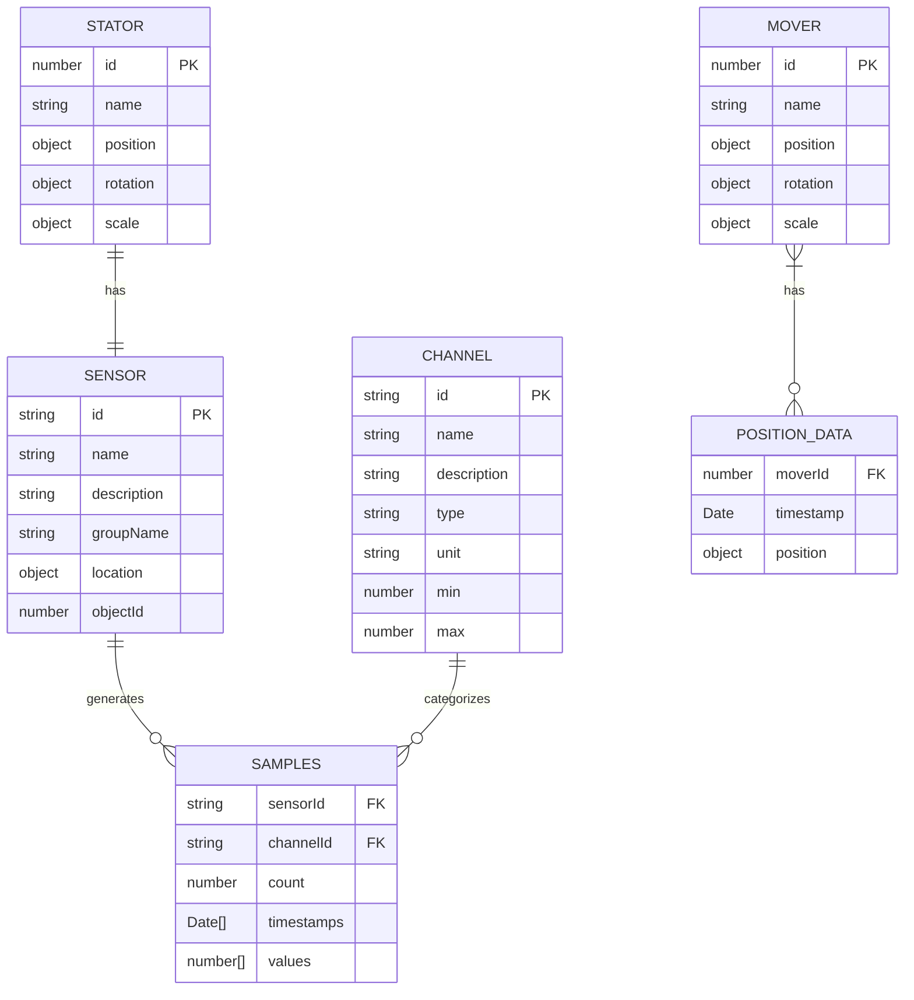

# Entity Relationship Diagram for Genius-DT

This document presents the Entity Relationship Diagram (ERD) for the Genius-DT system, illustrating the data model and relationships between key entities.

## 1. Introduction

The Genius-DT system uses a data model centered around sensors, channels, and historical data samples. This ERD provides a visual representation of these entities and their relationships, helping to understand how data is structured and flows through the system.

## 2. Entity Relationship Diagram

## 3. Entity Descriptions

### Sensor
Represents an IoT sensor in the system. Each sensor is associated with a specific stator component in the 3D model and can generate data for multiple channels (e.g., temperature, vibration).

### Channel
Represents a type of measurement that sensors can provide. Each channel has a specific data type, unit, and valid range (min/max values).

### Samples
Represents historical data collected from sensors. Each sample is associated with a specific sensor and channel, and contains a series of timestamped values.

### Stator
Represents a stator component in the elevator's 3D model. Each stator has one associated sensor.

### Mover
Represents a mover component in the elevator's 3D model. Movers can change position over time.

### Position Data
Represents historical position data for movers, tracking how they move over time.

## 4. Relationship Descriptions

- **Sensor to Samples**: One-to-many relationship. A sensor can generate multiple samples, one for each channel it supports.
- **Channel to Samples**: One-to-many relationship. A channel can have multiple samples, one for each sensor that supports it.
- **Stator to Sensor**: One-to-one relationship. Each stator has exactly one associated sensor.
- **Mover to Position Data**: One-to-many relationship. A mover can have multiple position data points over time.

## 5. Implementation Notes

In the actual implementation:
- Sensors are stored in a Map<SensorID, Sensor>
- Channels are stored in a Map<ChannelID, Channel>
- Samples are stored in a nested Map structure: Map<SensorID, Map<ChannelID, Samples>>
- The SensorDataManager class implements the HistoricalDataView interface to provide access to this data

This structure allows for efficient lookup of sensor data by sensor ID and channel ID, which is important for real-time visualization and analysis.