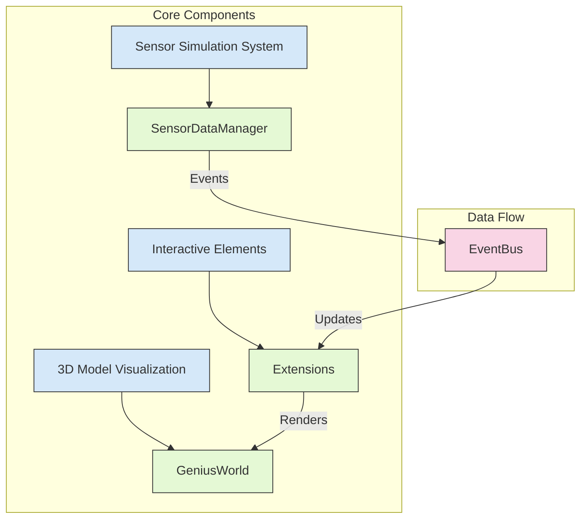
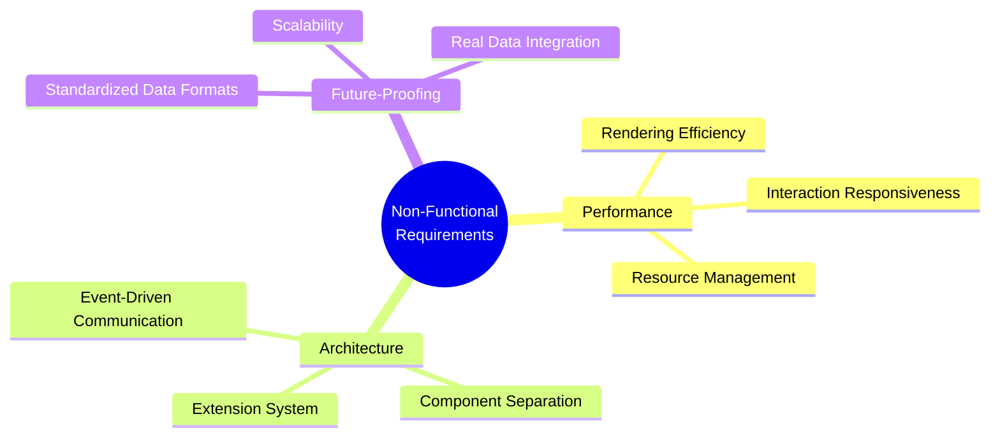
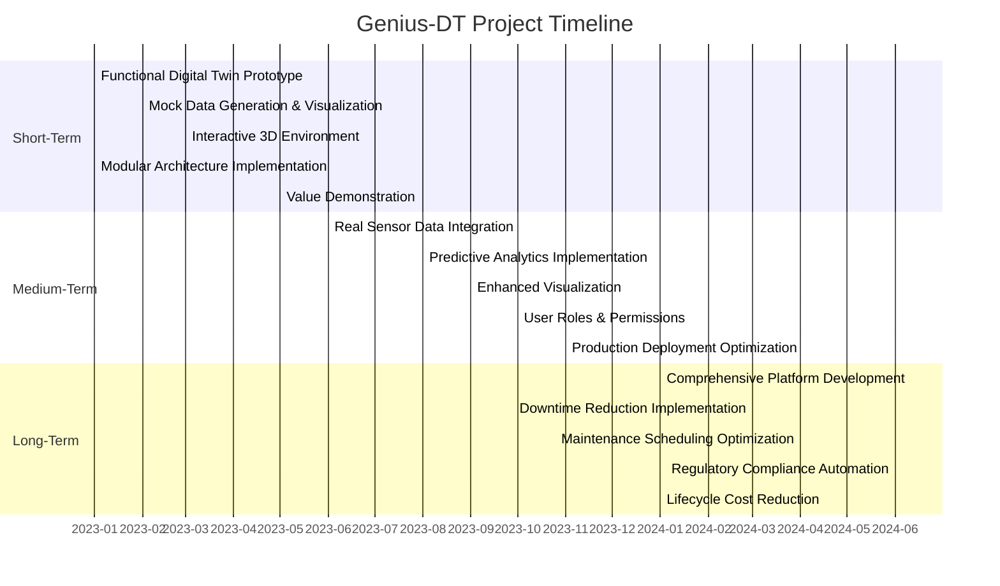
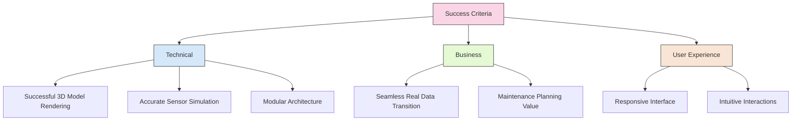

# Genius-DT: Project Requirements and Goals

## Introduction
Genius-DT is a Digital Twin platform designed for Linear Motor Elevators (LMEs), focusing on predictive maintenance and real-time monitoring. This document outlines the key requirements and goals for the project, serving as a guide for development and implementation.

The platform uses mock data integration as an initial approach (as referenced in section 3.4.1 of the thesis), allowing for development and testing without physical hardware dependencies. This approach enables the transition from conceptual design to practical implementation using Three.js and TypeScript.

## Functional Requirements

### System Architecture Overview

### 3D Model Visualization

| Feature | Description | Implementation Details |
|---------|-------------|------------------------|
| **Model Loading and Rendering** | • Load and render the Linear Motor Elevator GLTF model • Support for complex model hierarchies • Optimized rendering for performance | • Uses `4ut.glb` model file • Component identification via naming patterns • Three.js optimization techniques |
| **Camera and Navigation Controls** | • Orbit controls for model exploration • Smooth camera transitions • Configurable camera parameters | • Orbit, pan, zoom functionality • Focus transitions on component selection • Adjustable field of view, near/far planes |
| **Object Selection and Highlighting** | • Interactive selection of model components • Visual highlighting • Multiple selection states | • Raycasting for selection • BoxHelperWrap for highlighting • Hover and selected states |

### Sensor Simulation System

| Feature | Description | Implementation Details |
|---------|-------------|------------------------|
| **Mock Data Generation** | • Temperature sensor simulation • Configurable data patterns • Support for multiple sensor types | • 20-30°C temperature range • Anomaly injection capability • Extensible sensor type system |
| **Time-Series Data Management** | • Historical data storage • Sliding window approach • Fixed-size data arrays | • Configurable history length • FIFO data management • MAX_DATA_POINTS limit (20) |
| **Real-Time Updates** | • Periodic data updates • Event-based notification • Synchronized visualization | • setInterval (1000ms) • EventBus for notifications • Coordinated UI updates |

### Interactive Elements

| Feature | Description | Implementation Details |
|---------|-------------|------------------------|
| **Sensor Visualization** | • Sprite-based indicators • Visual differentiation • Dynamic visual feedback | • Positioned at stator locations • Color/shape coding by type and state • Scale and opacity changes |
| **Hover and Selection Effects** | • Hover effects • Selection mechanism • Camera transitions | • Visual feedback on hover • Click selection with highlighting • Automatic camera focus |
| **Information Panels** | • Dynamic UI panels • Real-time data display • Component-specific information | • Detailed sensor information • Historical data context • Relevant component details |

## Non-Functional Requirements

### Architecture and Quality Attributes

### Performance Optimization

| Attribute | Requirements | Implementation Approach |
|-----------|--------------|-------------------------|
| **Rendering Efficiency** | • Optimized scene management • Efficient object rendering • Level-of-detail handling | • Three.js optimization techniques • Object instancing for repeated elements • Progressive loading for complex models |
| **Interaction Responsiveness** | • Fast object selection • Smooth interaction handling • Fluid animations | • Efficient raycasting algorithms • Debounced event handling • Optimized transition animations |
| **Resource Management** | • Efficient memory usage • Proper resource cleanup • Optimized asset handling | • Memory-efficient data structures • Proper disposal of Three.js objects • Asset loading and caching strategies |

### Modular Architecture

| Attribute | Requirements | Implementation Approach |
|-----------|--------------|-------------------------|
| **Extension System** | • Pluggable functionality • Standardized lifecycle • Separation of concerns | • Plugin-based architecture • Lifecycle methods (init, update, activate, deactivate, dispose) • Clear separation of rendering and business logic |
| **Component Separation** | • Decoupled components • Well-defined interfaces • Testable design | • GeniusWorld/business logic separation • Interface-based communication • Dependency injection patterns |
| **Event-Driven Communication** | • Centralized event handling • Type-safe events • Consistent event structure | • Mitt event bus implementation • TypeScript type definitions for events • Standardized event naming and payload formats |

### Future-Proof Data Structures

| Attribute | Requirements | Implementation Approach |
|-----------|--------------|-------------------------|
| **Standardized Data Formats** | • Consistent sensor data • Well-defined metadata • Extensible data models | • HistoricalDataView interface • Structured sensor and component metadata • Flexible type system for future sensors |
| **Scalability Considerations** | • Support for growth • Efficient data handling • Effective data presentation | • Scalable sensor management • Optimized data structures for large datasets • Pagination and filtering capabilities |
| **Real Data Integration Readiness** | • Seamless transition path • Abstracted data sources • Flexible data adapters | • Consistent internal data structures • Source-agnostic data layer • Configurable format adapters |

## Project Goals

### Project Timeline and Milestones

### Goals by Timeline

| Timeline | Goals | Key Deliverables |
|----------|-------|------------------|
| **Short-Term** | • Develop a functional Digital Twin prototype • Implement mock data generation and visualization • Create an interactive 3D environment • Establish a modular architecture • Demonstrate the value of Digital Twin technology | • Working prototype with GLTF model • Temperature sensor simulation • Interactive 3D viewer with controls • Extension-based architecture • Proof-of-concept demonstrations |
| **Medium-Term** | • Integrate real sensor data • Implement predictive analytics • Enhance visualization capabilities • Develop user roles and permissions • Optimize for production deployment | • Physical sensor integration • Predictive maintenance algorithms • Additional sensor visualizations • Role-based access control • Performance-optimized platform |
| **Long-Term** | • Create a comprehensive predictive maintenance platform • Reduce elevator downtime by 50% • Extend equipment longevity • Ensure regulatory compliance • Decrease lifecycle maintenance costs | • Full-featured maintenance platform • Automated failure prediction • Optimized maintenance scheduling • Compliance reporting automation • Cost reduction metrics |

## Success Criteria

| Category | Success Criteria | Measurement Method |
|----------|------------------|-------------------|
| **Technical** | • Successful rendering and interaction with 3D model • Accurate simulation and visualization of sensor data • Modular and extensible architecture | • Model loads and displays correctly • Sensor data accurately represented • New extensions can be added without core changes |
| **Business** | • Seamless transition path from mock to real data • Demonstrable value for maintenance planning | • Real sensor data integration without redesign • Maintenance insights lead to actionable decisions |
| **User Experience** | • Responsive and intuitive user interface • Effective visualization of complex data | • UI responds within 100ms to user actions • Users can understand system state at a glance |
