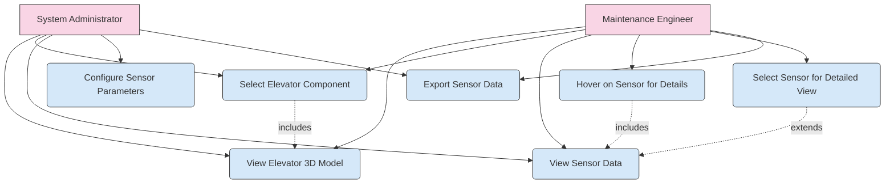
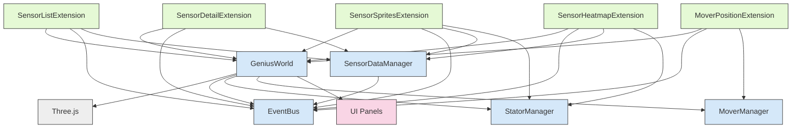
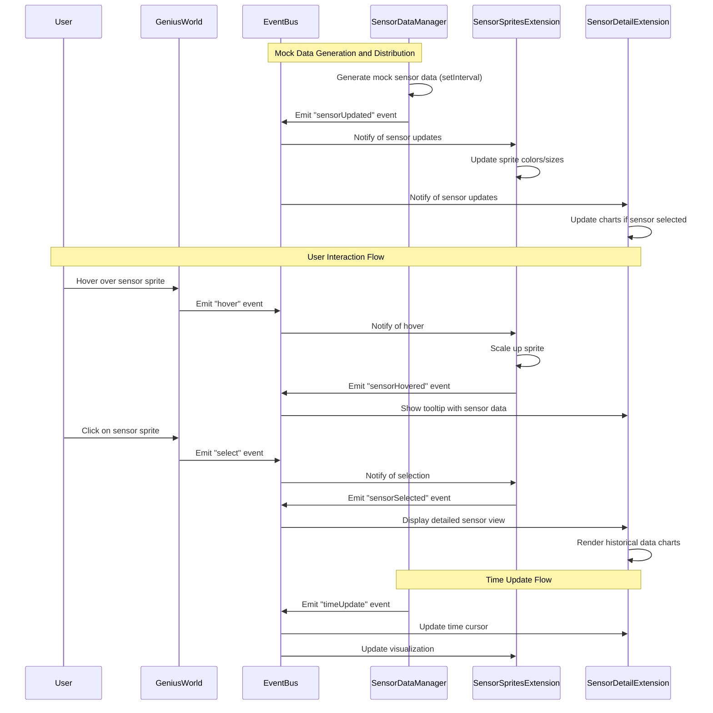

# 4.3.2 System Design and UML Diagrams

## 1. Introduction

This section describes the internal architecture and design logic of the Genius-DT prototype using software engineering models. The design presented here supports the key requirements of scalability, modularity, and future real-time data integration.

The Genius-DT system is built using an event-driven architecture that allows for loose coupling between components, making it easier to extend and maintain. The diagrams in this section illustrate how the various components interact to provide a cohesive digital twin experience.

## 2. Use Case Diagram

The Use Case Diagram illustrates the key user interactions with the Genius-DT system. The primary actors are Maintenance Engineers and System Administrators, who interact with the system in different ways based on their roles.

Key user interactions include:
- Viewing real-time data on elevator components
- Hovering or selecting components to see sensor information
- Observing historical trends of sensor data
- Configuring sensor parameters (for administrators)
- Exporting sensor data for further analysis



The diagram shows that both Maintenance Engineers and System Administrators can view the 3D model and sensor data, but only System Administrators can configure sensor parameters. The "extends" and "includes" relationships show how some use cases build upon others, creating a hierarchical interaction flow.

## 3. Component Diagram

The Component Diagram identifies the major software components/modules of the Genius-DT system and illustrates how they interact. The system is organized into core components, extensions, and UI components.

Key components include:
- **GeniusWorld**: The central component responsible for 3D scene rendering and interaction
- **SensorDataManager**: Produces and manages simulated sensor data
- **StatorManager**: Manages stator components in the 3D model
- **MoverManager**: Manages mover components in the 3D model
- **EventBus**: Handles communication between modules using an event-driven approach
- Various extensions that add specific functionality to the system



The diagram shows how GeniusWorld serves as the central component that interacts with Three.js for 3D rendering and manages various extensions. The EventBus facilitates communication between components, allowing for a loosely coupled architecture. Extensions add specific functionality to the system, such as sensor visualization, sensor details, and heatmaps.

## 4. Sequence Diagram (Mock Data Flow)

The Sequence Diagram illustrates the data flow lifecycle in the Genius-DT system, focusing on how mock sensor data is generated, distributed, and visualized. It also shows how user interactions trigger events and updates in the system.

The data flow can be summarized as follows:
- SensorDataManager generates mock sensor data at regular intervals
- EventBus broadcasts update events to interested components
- SensorSpritesExtension and SensorDetailExtension process and visualize the data
- User interactions (hover, click) trigger additional events and updates



The sequence diagram clearly shows the event-driven nature of the system, with events flowing through the EventBus to coordinate updates between components. It also illustrates how user interactions trigger a chain of events that result in visual updates to the interface.

## 5. Class Diagram (Data Structures)

The following diagram illustrates the key data structures used in the Genius-DT system, focusing on the sensor data model:

```
+-------------------+       +-------------------+       +-------------------+
|      Sensor       |       |      Channel      |       |      Samples      |
|-------------------|       |-------------------|       |-------------------|
| name: string      |       | name: string      |       | count: number     |
| description: string|      | description: string|      | timestamps: Date[]|
| groupName: string |       | type: ChannelDataType|    | values: number[]  |
| location: {x,y,z} |       | unit: string      |       +-------------------+
| objectId: number  |       | min: number       |
+-------------------+       | max: number       |
                            +-------------------+
                                    ^
                                    |
+-------------------+               |
| HistoricalDataView|---------------+
|-------------------|
| getSensors()      |
| getChannels()     |
| getTimerange()    |
| getSamples()      |
+-------------------+
        ^
        |
+-------------------+
| SensorDataManager |
|-------------------|
| sensors: Map      |
| channels: Map     |
| sensorSamples: Map|
| startDataUpdates()|
| stopUpdates()     |
+-------------------+
```

The class diagram shows the structure of the sensor data model:
- **Sensor**: Represents an IoT sensor with properties like name, location, and objectId
- **Channel**: Represents a sensor channel with properties like name, type, unit, min, and max
- **Samples**: Stores historical data with timestamps and values
- **HistoricalDataView**: Interface for accessing sensor data
- **SensorDataManager**: Implements HistoricalDataView and manages sensor data

This data model provides a flexible and extensible way to represent and access sensor data in the system.

## 6. Design Considerations

The Genius-DT system incorporates several key design considerations to ensure it meets the requirements for scalability, modularity, and future real-time data integration:

### Event-Driven Architecture
The system uses an event-driven architecture with a central EventBus that facilitates communication between components. This approach offers several advantages:
- **Loose coupling**: Components don't need direct references to each other, they just need to know about the events they're interested in
- **Scalability**: New components can be added without modifying existing ones
- **Testability**: Components can be tested in isolation by simulating events

### Modular Extension System
The system uses a modular extension system that allows functionality to be added or removed dynamically:
- **Pluggable extensions**: Extensions can be added to GeniusWorld to provide specific functionality
- **Separation of concerns**: Each extension focuses on a specific aspect of the system
- **Reusability**: Extensions can be reused across different instances of GeniusWorld

### Mock Data Generation with Real-Time Integration Path
The current implementation uses mock data generation to simulate sensor data, but it's designed to be easily replaced with real-time data sources:
- **Consistent interface**: The HistoricalDataView interface provides a consistent way to access sensor data, regardless of the source
- **Event-based updates**: Data updates are propagated through events, making it easy to switch from mock data to real-time data
- **Time-based visualization**: The system supports time-based visualization, which will work with both mock and real-time data

### 3D Visualization with Three.js
The system uses Three.js for 3D visualization, providing a powerful and flexible way to render the digital twin:
- **WebGL-based rendering**: Provides high-performance 3D rendering in the browser
- **Component-based scene graph**: Allows for complex 3D scenes with hierarchical relationships
- **Extensible material system**: Supports custom shaders for advanced visualization effects like heatmaps

These design considerations ensure that the Genius-DT system is well-positioned to meet current requirements and adapt to future needs, particularly the integration of real-time data from actual elevator sensors.